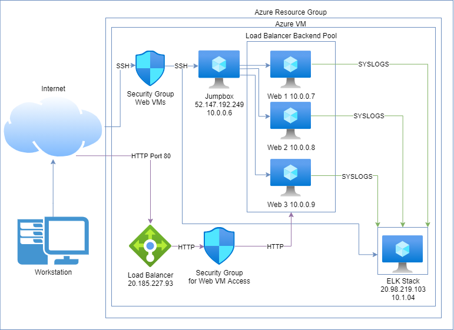

## Automated ELK Stack Deployment

The files in this repository were used to configure the network depicted below.

These files have been tested and used to generate a live ELK deployment on Azure. They can be used to either recreate the entire deployment pictured above. Alternatively, select portions of the elk_playbook.yml file may be used to install only certain pieces of it, such as Filebeat.

This document contains the following details:
- Description of the Topology
- Access Policies
- ELK Configuration
  - Beats in Use
  - Machines Being Monitored
- How to Use the Ansible Build

### Description of the Topology

The main purpose of this network is to expose a load-balanced and monitored instance of DVWA, the Damn Vulnerable Web Application.

Load balancing ensures that the application will be highly available, in addition to restricting access to the network.

Integrating an ELK server allows users to easily monitor the vulnerable VMs for changes to the operating system/usage and system files.

The configuration details of each machine may be found below:

| Name     | Function | IP Address | Operating System |
|----------|----------|------------|------------------|
| Jump Box | Gateway  | 10.0.0.6   | Linux            |
| Web 1    | Server   | 10.0.0.7   | Linux            |
| Web 2    | Server   | 10.0.0.8   | Linux            |
| Web 3    | Server   | 10.0.0.9   | Linux            |
| ELK Stack| Monitor  | 10.1.0.4   | Linux            |

### Access Policies

The machines on the internal network are not exposed to the public Internet.

Only the jumpbox machine/ELK Stack can accept connections from the Internet. Access to this machine is only allowed from the following IP addresses:

108.52.81.245

Machines within the network can only be accessed by the jumpbox machine.

Access to the ELK Stack is only allowed from the following IP addresses:

108.52.81.245

A summary of the access policies in place can be found in the table below.

| Name     | Publicly Accessible | Allowed IP Addresses |
|----------|---------------------|----------------------|
| Jump Box | Yes                 | 108.52.81.245        |
| ELK Stack| Yes                 | 108.52.81.245        |
| Web VMs  | No                  | 52.147.192.249       |

### Elk Configuration

Ansible was used to automate configuration of the ELK machine. No configuration was performed manually, which is advantageous because it allows for easy scalability.

The playbook implements the following tasks:

1. Increase memory to run SEBP container
2. Installs Apache
3. Installs Python
4. Installs Docker
5. Installing a custom SEBP/ELK container

Here's a link to the ELK playbook:

[ELK Playbook](Ansible/elk_playbook.yml)

The following screenshot displays the result of running `docker ps` after successfully configuring the ELK instance.

'''
CONTAINER ID   IMAGE          COMMAND                  CREATED      STATUS       PORTS                                                                              NAMES
8ebc1f7e617f   sebp/elk:761   "/usr/local/bin/star…"   5 days ago   Up 4 hours   0.0.0.0:5044->5044/tcp, 0.0.0.0:5601->5601/tcp, 0.0.0.0:9200->9200/tcp, 9300/tcp   sebp_container
'''

### Target Machines & Beats
This ELK server is configured to monitor the following machines:
1. Web 1
2. Web 2
3. Web 3

We have installed the following Beats on these machines:

1. Filebeat
2. Metricbeat

These Beats allow us to collect the following information from each machine:

1. Metricbeat allows collecting CPU usage and performance information from modules running on the server, such as Apache or Mysql.
2. Filebeat tracks changes to designated files and pipes these changes to searchable logs.

### Using the Playbook
In order to use the playbook, you will need to have an Ansible control node already configured. Assuming you have such a control node provisioned:

SSH into the control node and follow the steps below:
- Copy the playbook file to control node.
- Update the /etc/ansible/hosts file to include the target servers.
- Run the playbook
- Navigate to the ELK Server, and see if the following command retrieves HTML:
  
  '''
  curl http://10.0.0.8:5601
  '''

- Which file is the playbook? Where do you copy it:

Here's the ELK playbook: 
[ELK Playbook](Ansible/elk_playbook.yml)

Copy this to your docker container.

Run it with 

ansible-playbook [playbook name]

Here are the beat playbooks and config files: 

1. [Filebeat Config Playbook](Ansible/filebeat-config.yml)
2. [Filebeat Playbook](Ansible/filebeat-playbook.yml)
3. [Metricbeat Config Playbook](Ansible/metricbeat-config.yml)
4. [Metricbeat Playbook](Ansible/metricbeat-playbook.yml)

Copy these to your docker container at:

/etc/ansible/roles

Run it with 

ansible-playbook [playbook name]

-  Which file do I update to make Ansible run the playbook on a specific machine:

/etc/ansible/hosts

-  How do I specify which machine to install the ELK server on versus which to install Filebeat on:

Edit the playbook to target a different range of hosts.

- Which URL do you navigate to in order to check that the ELK server is running?:

http://20.98.219.103:5601/app/kibana#/home

- What are the specific commands the user will need to run to download the playbook, update the files, etc:

Install git:&nbsp;

1. apt-get update
2. apt-get upgrade -y
3. apt-get install -y git

Clone git repository:

1. cd /etc/ansible
2. mkdir files
3. git clone https://github.com/takeitgraceful/elkstack.git
4. Move Playbooks and hosts file Into `/etc/ansible`
5. cp elkstack/*.yml .
6. ansible-playbook [playbook name]

